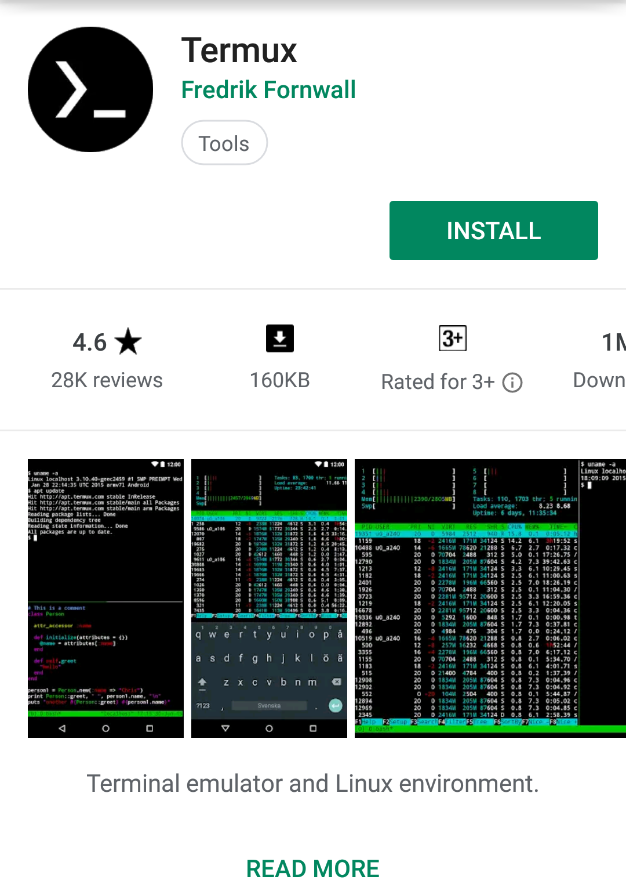

[Termux](https://play.google.com/store/apps/details?id=com.termux) is a terminal emulator which  provides a linux-like environment of for your Android Device!


[Termux](https://play.google.com/store/apps/details?id=com.termux) combines powerful terminal emulation with an extensive Linux package collection.

## Features
* Enjoy the bash and zsh shells.
* Edit files with nano and vim.
* Access servers over ssh.
* Develop in C with clang, make and gdb.
* Use the python console as a pocket calculator.
* Check out projects with git and subversion.
* Run text-based games with frotz.
* Run linux images with proot

## Packages
Termux comes with it's own package manager called `pkg` (can also be referenced with normal `apt`).
So to install some package you do
```bash
$ pkg install package-name
```
and it will automatically run `apt update` before installing and then installs the package from it's vast repository
which includes Python, Nodejs, PostgreSQL, Redis, etc.

Want to read the wiki?
Click [here](https://wiki.termux.com)

### Need help? Check out `#termux` channel on our [Discord Server](../support.md)!