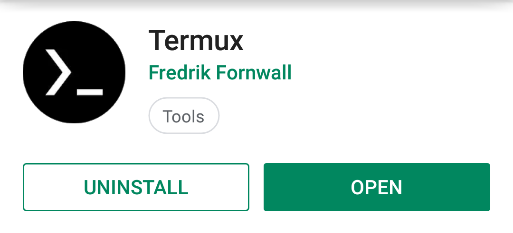

hero: Installation Procedure for Termux

## **Open Play Store and search for Termux**
Or click [here](https://play.google.com/store/apps/details?id=com.termux)

!!! example ""
    

??? danger "Error: Your device isn't compatible with this version"
    

    If you get the above error then that means your Android version is lower than 5.0.
    Either update it or choose one of the alternates(Guides for whom are coming soon!)

## **Click on the Install button**
The App is just 150-200kbs so it shouldn't take much time!

!!! success "This is how it should look after installing"
    
